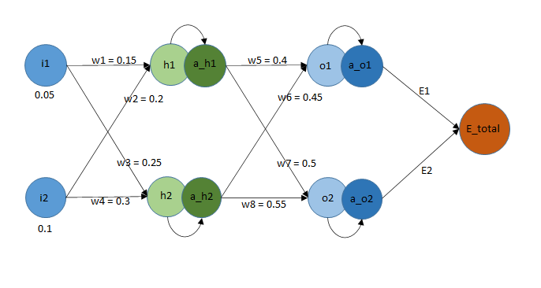

## Train a Simple Neural Network using Microsoft Excel

### Neural Network Diagram

> 1. Draw the neural network diagram as shown in the figure.
> 2. Connect all the neurons using arrows and mark them with appropriate names and values.

---

### FeedForward Equations

> 1. Write all the feedforward equations using the above diagram as reference.
> 2. Use sigmoid as the activation function for the hidden and output layers.

---

### Backpropagation Equations

> 1. Starting with weight w5 (as it is connected to the last layer), calculate the equation of backpropagation. Trace the path from the output to the weight and use chain rule.
> 2. Change the final equation of w5 suitably to get w6, w7 and w8. Again, trace the paths of the weights and put the appropriate variables in the equations.
> 3. Similarly, repeat the steps for w1, w2, w3 and w4. It will be easier to break down the chain rule into two steps, one from output to hidden layer and another from hidden to input layer.

---

### Training the Neural Network

> 1. Initialize all the values of the neurons and weights as shown in the neural network diagram.
> 2. Write the equations of the weights and their gradients using the above equations and choosing the right cell numbers.
> 3. Use a constant learning rate to update the weights. This will be changed to observe the effect of learning rate on loss during training.
---

### Loss vs. Iterations Graphs

> ### Observation: 
> We can observe that higher the value of learning rate, higher the rate of convergence of loss for this particular problem. This is not true in most deep neural network problems as the learning rate is generally kept low to update the weights slowly. 

---

