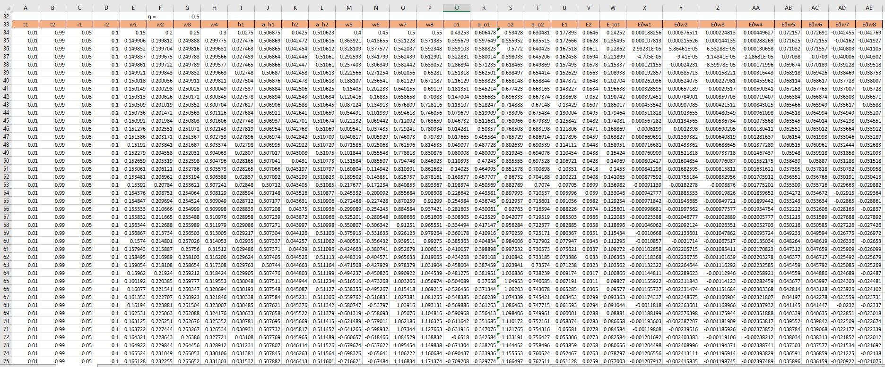

# Train a Simple Neural Network using Microsoft Excel

## Neural Network Diagram

## FeedForward Equations

## Backpropagation Equations

## Training the Neural Network

## Loss vs. Iterations Graphs

