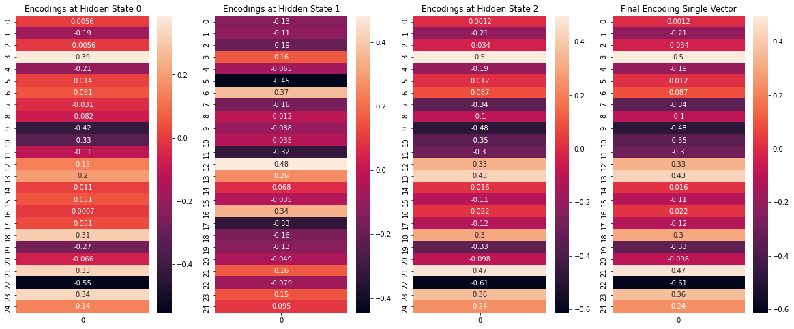
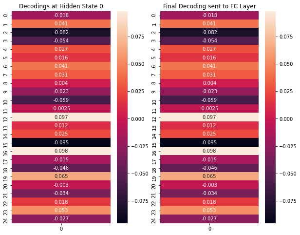

Group Members: Nishad, Soma, Bharath, Dinesh

# Encoder-Decoder Architecture for Classification on Tweets dataset

The objective to build a model with simple encoder-decoder architecture for classification and visualize the encoding and decoding vectors at each hidden step.

## Data Preprocessing
* We use the [tweets](./static/tweets.csv) dataset that contains 1364 tweets 
* Label count 
```
0 (Negative) : 931
1 (Positive) : 352
2 (Neutral)  : 81
```
* Train Test split
```
Length of training data   :  1159
Length of validation data :  205
```

## Network Design

### Encoder

```python
class Encoder(nn.Module):
    
    # Define all the layers used in model
    def __init__(self, vocab_size, embedding_dim, hidden_dim, n_layers, dropout):        
        super().__init__()              

        # Embedding layer
        self.embedding = nn.Embedding(vocab_size, embedding_dim)

        # LSTM layer
        self.encoder = nn.LSTM(embedding_dim, 
                           hidden_dim, 
                           num_layers=n_layers, 
                           dropout=dropout,
                           batch_first=True)
                
    def forward(self, text, text_lengths, packed=False, debug=False, print_outputs=False):
          
        # text = [batch size, text_length]
        embedded = self.embedding(text)
        # embedded = [batch size, text_length, emb dim]

        output, (hidden, cell) = self.encoder(embedded)
        # hidden = [num layers, batch size, hid dim]
        # cell = [num layers, batch size, hid dim]

        encoding = hidden.permute(1, 0, 2) # Use the last vector and transpose the dimensions to bring it to correct shape
        # encoding = [batch_size, num_layers, hid_dim] 

        return encoding, (hidden, cell)
```

### Decoder
```python
class Decoder(nn.Module):
    
    # Define all the layers used in model
    def __init__(self, input_dim, hidden_dim, output_dim, n_layers, dropout):        
        super().__init__()     

        # LSTM layer
        self.decoder = nn.LSTM(input_dim, 
                           hidden_dim, 
                           num_layers=n_layers, 
                           dropout=dropout,
                           batch_first=True)
        
        # Dense layer
        self.fc = nn.Linear(hidden_dim, output_dim)
        
    def forward(self, input, hidden_states, debug=False, print_outputs=False):

        hidden, cell = hidden_states
        output, (hidden, cell) = self.decoder(input)
        # hidden = [num layers, batch size, hid dim]
        # cell = [num layers, batch size, hid dim]
        
        # Final dense layer
        dense_outputs = self.fc(hidden[0])
            
        return dense_outputs
```

### Encoder-Decoder
```python
class Model(nn.Module):
  def __init__(self, encoder, decoder):
    super().__init__()

    self.encoder = encoder
    self.decoder = decoder

  def forward(self, text, text_length, packed=False, debug=False, print_outputs=False):

    encoding, hidden_states = self.encoder(text,
                                       text_length,
                                       packed=packed,
                                       debug=debug,
                                       print_outputs=print_outputs)
    
    output = self.decoder(encoding,
                          hidden_states,
                          debug=debug,
                          print_outputs=print_outputs)

    return output
```    

### Model layers
```python
Model(
  (encoder): Encoder(
    (embedding): Embedding(4653, 256)
    (encoder): LSTM(256, 25, batch_first=True, dropout=0.2)
  )
  (decoder): Decoder(
    (decoder): LSTM(25, 25, batch_first=True, dropout=0.2)
    (fc): Linear(in_features=25, out_features=3, bias=True)
  )
)
The model has 1,224,746 trainable parameters
```

## Model Training
```
Epoch: 01 | Epoch Time: 0m 1s
	Train Loss: 1.084 | Train Acc: 55.91%
	 Val. Loss: 1.042 |  Val. Acc: 74.11%
Epoch: 02 | Epoch Time: 0m 0s
	Train Loss: 1.054 | Train Acc: 66.00%
	 Val. Loss: 0.998 |  Val. Acc: 75.00%
Epoch: 03 | Epoch Time: 0m 0s
	Train Loss: 1.025 | Train Acc: 67.77%
	 Val. Loss: 0.951 |  Val. Acc: 75.00%
Epoch: 04 | Epoch Time: 0m 0s
	Train Loss: 0.989 | Train Acc: 68.19%
	 Val. Loss: 0.901 |  Val. Acc: 75.00%
Epoch: 05 | Epoch Time: 0m 0s
	Train Loss: 0.949 | Train Acc: 67.86%
	 Val. Loss: 0.852 |  Val. Acc: 75.00%
Epoch: 06 | Epoch Time: 0m 0s
	Train Loss: 0.908 | Train Acc: 67.86%
	 Val. Loss: 0.800 |  Val. Acc: 75.00%
Epoch: 07 | Epoch Time: 0m 0s
	Train Loss: 0.867 | Train Acc: 68.19%
	 Val. Loss: 0.760 |  Val. Acc: 75.45%
Epoch: 08 | Epoch Time: 0m 0s
	Train Loss: 0.824 | Train Acc: 69.04%
	 Val. Loss: 0.730 |  Val. Acc: 75.45%
Epoch: 09 | Epoch Time: 0m 0s
	Train Loss: 0.784 | Train Acc: 69.21%
	 Val. Loss: 0.708 |  Val. Acc: 75.45%
Epoch: 10 | Epoch Time: 0m 0s
	Train Loss: 0.742 | Train Acc: 69.72%
	 Val. Loss: 0.693 |  Val. Acc: 75.45%
Epoch: 11 | Epoch Time: 0m 0s
	Train Loss: 0.712 | Train Acc: 72.25%
	 Val. Loss: 0.683 |  Val. Acc: 75.45%
Epoch: 12 | Epoch Time: 0m 0s
	Train Loss: 0.687 | Train Acc: 73.68%
	 Val. Loss: 0.662 |  Val. Acc: 75.45%
Epoch: 13 | Epoch Time: 0m 0s
	Train Loss: 0.662 | Train Acc: 75.46%
	 Val. Loss: 0.642 |  Val. Acc: 76.79%
Epoch: 14 | Epoch Time: 0m 0s
	Train Loss: 0.632 | Train Acc: 77.57%
	 Val. Loss: 0.626 |  Val. Acc: 77.23%
Epoch: 15 | Epoch Time: 0m 0s
	Train Loss: 0.599 | Train Acc: 79.01%
	 Val. Loss: 0.608 |  Val. Acc: 81.70%
```
* Model achieves validation accuracy of 81.70% in 15 epochs

## Evaluate the Encoding and Decoding vectors for the input "print the outputs"
### Encoder Shapes and Vectors
```
Before entering embedding layer
Text shape:  torch.Size([1, 3])
Text length shape:  torch.Size([1])
Text length:  tensor([3])
Embedding shape:  torch.Size([1, 3, 256])
Output shape:  torch.Size([1, 3, 25])
Hidden shape:  torch.Size([1, 1, 25])
Cell shape:  torch.Size([1, 1, 25])
Encoding shape:  torch.Size([1, 1, 25])
```


### Decoder Shapes and Vectors
```
Before entering decoder
Input shape:  torch.Size([1, 1, 25])
Hidden states:  2
Output shape:  torch.Size([1, 1, 25])
Hidden shape:  torch.Size([1, 1, 25])
Cell shape:  torch.Size([1, 1, 25])
Dense outputs shape:  torch.Size([1, 3])
```


### Encoder-Decoder shapes for a random batch
```
Before entering embedding layer
Text shape:  torch.Size([32, 40])
Text length shape:  torch.Size([32])
Text length:  tensor([40, 40, 37, 37, 37, 35, 34, 34, 34, 33, 33, 33, 33, 33, 32, 32, 32, 32,
        31, 31, 31, 31, 31, 31, 31, 31, 31, 31, 31, 30, 30, 30])
Embedding shape:  torch.Size([32, 40, 256])
Output shape:  torch.Size([32, 40, 25])
Hidden shape:  torch.Size([1, 32, 25])
Cell shape:  torch.Size([1, 32, 25])
Encoding shape:  torch.Size([32, 1, 25])

Before entering decoder
Input shape:  torch.Size([32, 1, 25])
Hidden states:  2
Output shape:  torch.Size([32, 1, 25])
Hidden shape:  torch.Size([1, 32, 25])
Cell shape:  torch.Size([1, 32, 25])
Dense outputs shape:  torch.Size([32, 3])
```
