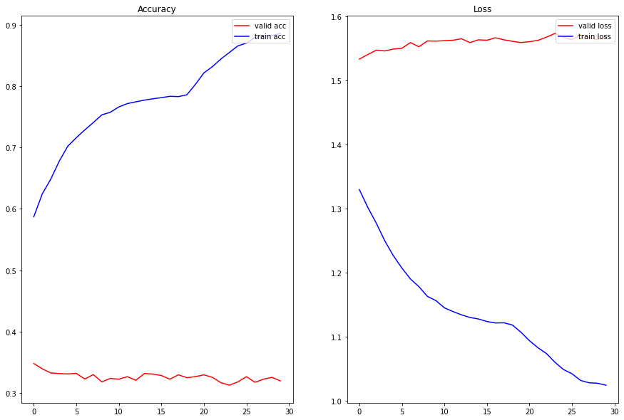

# SST Classification

## Input Data Preparation - Stanford Sentiment Analysis TreeBank
The original dataset includes:

1. original_rt_snippets.txt contains 10,605 processed snippets from the original pool of Rotten Tomatoes HTML files. Please note that some snippet may contain multiple sentences.
2. dictionary.txt contains all phrases and their IDs, separated by a vertical line |
3. sentiment_labels.txt contains all phrase ids and the corresponding sentiment labels, separated by a vertical line. Note that you can recover the 5 classes by mapping the positivity probability using the following cut-offs: [0, 0.2], (0.2, 0.4], (0.4, 0.6], (0.6, 0.8], (0.8, 1.0] for very negative, negative, neutral, positive, very positive, respectively. Please note that phrase ids and sentence ids are not the same.
4. SOStr.txt and STree.txt encode the structure of the parse trees. STree encodes the trees in a parent pointer format. Each line corresponds to each sentence in the datasetSentences.txt file. The Matlab code of this paper will show you how to read this format if you are not familiar with it.
5. datasetSentences.txt contains the sentence index, followed by the sentence string separated by a tab. These are the sentences of the train/dev/test sets.
6. datasetSplit.txt contains the sentence index (corresponding to the index in datasetSentences.txt file) followed by the set label separated by a comma: 1 = train 2 = test 3 = dev

Please note that the datasetSentences.txt file has more sentences/lines than the original_rt_snippet.txt. Each row in the latter represents a snippet as shown on RT, whereas the former is each sub sentence as determined by the Stanford parser.

### Data Handling
For the purpose of this notebook, we do the following:

1. From datasentences.txt, we take each sentence and find the corresponding "phrase ids" in dictionary.txt by checking the presence of "sentence" in "phrase".
2. Using the "phrase ids" we retrieve the "sentiment values" from sentiment_labels.txt.
3. Convert floating-point labels into 5 classes (0-0.2, 0.2-0.4, 0.4-0.6, 0.6-0.8, 0.8-1.0)


### Training and Test Dataset
After applying above techniques we get a combined DataFrame that has the following fields:

1. **sentence_index** : Original sentence_index in the datasetSentences.txt
2. **sentence**: The actual sentence
3. **phrase ids**: The Phrase_Id used for mapping/retrieving sentiment score
4. **sentiment values**: Actual Sentiment score for the sentence

## Model Architecture
```
classifier(
  (embedding): Embedding(16406, 256)
  (encoder): LSTM(256, 128, num_layers=2, batch_first=True, dropout=0.4, bidirectional=True)
  (fc): Linear(in_features=128, out_features=5, bias=True)
)
The model has 4,991,109 trainable parameters
```

## Training Logs
```
	Epoch: 0 | Train Loss: 1.329 | Train Acc: 58.71%
	 Val. Loss: 1.533 |  Val. Acc: 34.77% 

	Epoch: 1 | Train Loss: 1.301 | Train Acc: 62.45%
	 Val. Loss: 1.540 |  Val. Acc: 33.90% 

	Epoch: 2 | Train Loss: 1.277 | Train Acc: 64.87%
	 Val. Loss: 1.547 |  Val. Acc: 33.23% 

	Epoch: 3 | Train Loss: 1.249 | Train Acc: 67.80%
	 Val. Loss: 1.546 |  Val. Acc: 33.12% 

	Epoch: 4 | Train Loss: 1.226 | Train Acc: 70.24%
	 Val. Loss: 1.549 |  Val. Acc: 33.07% 

	Epoch: 5 | Train Loss: 1.207 | Train Acc: 71.62%
	 Val. Loss: 1.550 |  Val. Acc: 33.15% 

	Epoch: 6 | Train Loss: 1.190 | Train Acc: 72.89%
	 Val. Loss: 1.559 |  Val. Acc: 32.24% 

	Epoch: 7 | Train Loss: 1.178 | Train Acc: 74.09%
	 Val. Loss: 1.552 |  Val. Acc: 32.95% 

	Epoch: 8 | Train Loss: 1.163 | Train Acc: 75.35%
	 Val. Loss: 1.561 |  Val. Acc: 31.77% 

	Epoch: 9 | Train Loss: 1.156 | Train Acc: 75.77%
	 Val. Loss: 1.561 |  Val. Acc: 32.33% 

	Epoch: 10 | Train Loss: 1.145 | Train Acc: 76.64%
	 Val. Loss: 1.562 |  Val. Acc: 32.21% 

	Epoch: 11 | Train Loss: 1.139 | Train Acc: 77.19%
	 Val. Loss: 1.562 |  Val. Acc: 32.62% 

	Epoch: 12 | Train Loss: 1.134 | Train Acc: 77.47%
	 Val. Loss: 1.565 |  Val. Acc: 32.03% 

	Epoch: 13 | Train Loss: 1.130 | Train Acc: 77.75%
	 Val. Loss: 1.559 |  Val. Acc: 33.13% 

	Epoch: 14 | Train Loss: 1.128 | Train Acc: 77.97%
	 Val. Loss: 1.563 |  Val. Acc: 33.04% 

	Epoch: 15 | Train Loss: 1.124 | Train Acc: 78.15%
	 Val. Loss: 1.562 |  Val. Acc: 32.81% 

	Epoch: 16 | Train Loss: 1.121 | Train Acc: 78.37%
	 Val. Loss: 1.566 |  Val. Acc: 32.21% 

	Epoch: 17 | Train Loss: 1.122 | Train Acc: 78.32%
	 Val. Loss: 1.563 |  Val. Acc: 32.92% 

	Epoch: 18 | Train Loss: 1.118 | Train Acc: 78.62%
	 Val. Loss: 1.561 |  Val. Acc: 32.45% 

	Epoch: 19 | Train Loss: 1.107 | Train Acc: 80.31%
	 Val. Loss: 1.559 |  Val. Acc: 32.62% 

	Epoch: 20 | Train Loss: 1.094 | Train Acc: 82.19%
	 Val. Loss: 1.560 |  Val. Acc: 32.92% 

	Epoch: 21 | Train Loss: 1.083 | Train Acc: 83.21%
	 Val. Loss: 1.562 |  Val. Acc: 32.51% 

	Epoch: 22 | Train Loss: 1.074 | Train Acc: 84.46%
	 Val. Loss: 1.567 |  Val. Acc: 31.63% 

	Epoch: 23 | Train Loss: 1.060 | Train Acc: 85.53%
	 Val. Loss: 1.573 |  Val. Acc: 31.23% 

	Epoch: 24 | Train Loss: 1.049 | Train Acc: 86.60%
	 Val. Loss: 1.567 |  Val. Acc: 31.77% 

	Epoch: 25 | Train Loss: 1.042 | Train Acc: 87.05%
	 Val. Loss: 1.563 |  Val. Acc: 32.62% 

	Epoch: 26 | Train Loss: 1.032 | Train Acc: 87.95%
	 Val. Loss: 1.571 |  Val. Acc: 31.71% 

	Epoch: 27 | Train Loss: 1.028 | Train Acc: 88.29%
	 Val. Loss: 1.567 |  Val. Acc: 32.21% 

	Epoch: 28 | Train Loss: 1.027 | Train Acc: 88.26%
	 Val. Loss: 1.563 |  Val. Acc: 32.51% 

	Epoch: 29 | Train Loss: 1.024 | Train Acc: 88.64%
	 Val. Loss: 1.568 |  Val. Acc: 31.91% 
```

## Training Graphs


## Prediction of 10 samples from the test dataset
```
Sentence :  But what is missing from it all is a moral .
Predicted : very negative
Target : negative

Sentence :  All leather pants & augmented boobs , Hawn is hilarious as she tries to resuscitate the fun - loving libertine lost somewhere inside the conservative , handbag - clutching Sarandon .
Predicted : negative
Target : positive

Sentence :  It kinda works and qualifies as cool at times , but is just too lame to work or be cool at others .
Predicted : very negative
Target : neutral

Sentence :  ` Stock up on silver bullets for director Neil Marshall 's intense freight train of a film . '
Predicted : negative
Target : positive

Sentence :  Frei assembles a fascinating profile of a deeply humanistic artist who , in spite of all that he 's witnessed , remains surprisingly idealistic , and retains an extraordinary faith in the ability of images to communicate the truth of the world around him .
Predicted : negative
Target : positive

Sentence :  You 'll just have your head in your hands wondering why Lee 's character did n't just go to a bank manager and save everyone the misery .
Predicted : very negative
Target : very negative

Sentence :  The enormous comic potential of an oafish idiot impersonating an aristocrat remains sadly unrealized .
Predicted : very negative
Target : negative

Sentence :  It has plenty of laughs .
Predicted : very negative
Target : positive

Sentence :  The problem with the mayhem in Formula 51 is not that it 's offensive , but that it 's boring .
Predicted : very negative
Target : negative

Sentence :  Not a bad journey at all .
Predicted : very negative
Target : positive
```
