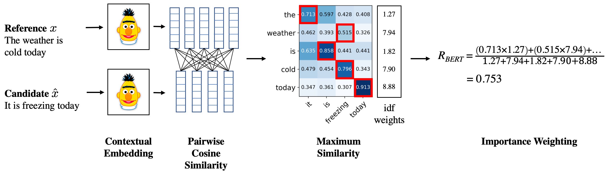

Group Members: Nishad, Dinesh, Soma, Bharath
# Evaluation Metrics

## 1. Precision, Recall and F1 Score


* Calculated on tweets dataset
* Confusion Matrix -


* Precision, Recall and F1 Score -
```
		precision    recall  f1-score   support

           0       0.75      0.97      0.84       134
           1       0.81      0.42      0.56        59
           2       0.00      0.00      0.00        12

    accuracy                           0.76       205
   macro avg       0.52      0.46      0.47       205
weighted avg       0.72      0.76      0.71       205
```

* Observations-
	1. The precision and recall is high for class 0.
	2. The precision is high and recall is low for class 1.
	3. The precision and recall is 0 for class 2. This is because the number of samples of class 2 in the test data is very less, 12 out of 205.
	
## 2. BLEU Score
* Calculated on Multi30k test dataset using maximum n-grams=4 and equal weight of 0.25 on each n-gram category -
```python
from torchtext.data.metrics import bleu_score

def calculate_bleu(model):
  model.eval()
  losses = 0

  # calculate score on test data
  test_iter = Multi30k(split='test', language_pair=(SRC_LANGUAGE, TGT_LANGUAGE))
  test_dataloader = DataLoader(test_iter, batch_size=BATCH_SIZE, collate_fn=collate_fn)

  tgt_sentences = []
  output_sentences = []

  for src, tgt in test_dataloader:
      src = src.to(device)
      tgt = tgt.to(device)

      output = model(src, tgt)
      output = torch.argmax(output, dim=2)

      # transpose to have batch first, size=[batch_size, text_length]
      tgt_list = torch.transpose(tgt, 1, 0).tolist()
      output_list = torch.transpose(output, 1, 0).tolist()

      for x, y in zip(tgt_list, output_list):
        # change integer to strings
        tgt_line = vocab_transform[TGT_LANGUAGE].lookup_tokens(x)
        # remove first token and truncate at first <eos> token found
        tgt_line = tgt_line[1:tgt_line.index("<eos>")]

        output_line = vocab_transform[TGT_LANGUAGE].lookup_tokens(y)
        # only if <eos> is found, we truncate the line at that point
        if "<eos>" in output_line:
          output_line = output_line[1:output_line.index("<eos>")]

        # collect all the lines in a list
        tgt_sentences.append([tgt_line])
        output_sentences.append(output_line)

  return bleu_score(output_sentences, tgt_sentences)
```
* BLEU scores for last 3 epochs -
```
BLEU Score: 16.95
BLEU Score: 17.77
BLEU Score: 18.90
```
* Observations-
	1. 18.90 percentage of n-grams can be found in the translation
	2. The Bleu score does not improve drastically in the last 3 epochs. This may be because the model might be predicting synonyms in the sentences, different length sentences, different arrangement of tokens etc.
	3. We can expect the Bleu score to drop if the model is trained further and starts predicting more synonyms (than original words in the target sentence).

## 3. Perplexity

* In general, perplexity is a measurement of how well a probability model predicts a sample. In the context of Natural Language Processing, perplexity is one way to evaluate language models.


* Less entropy (or less disordered system) is favorable over more entropy. Because predictable results are preferred over randomness. This is why people say low perplexity is good and high perplexity is bad since the perplexity is the exponentiation of the entropy (and you can safely think of the concept of perplexity as entropy).

```python
    print(f'\tTrain Loss: {train_loss:.3f} | Train PPL: {math.exp(train_loss):7.3f}')
    print(f'\t Val. Loss: {valid_loss:.3f} |  Val. PPL: {math.exp(valid_loss):7.3f}')
```
* Perplexity for last 3 epochs -
```
	Train Loss: 2.754 | Train PPL:  15.709
	 Val. Loss: 2.996 |  Val. PPL:  20.015

	Train Loss: 2.534 | Train PPL:  12.600
	 Val. Loss: 2.951 |  Val. PPL:  19.127

	Train Loss: 2.318 | Train PPL:  10.151
	 Val. Loss: 2.964 |  Val. PPL:  19.373
```

## 4. BERT Score

* BERTScore leverages the pre-trained contextual embeddings from BERT and matches words in candidate and reference sentences by cosine similarity. It has been shown to correlate with human judgment on sentence-level and system-level evaluation. Moreover, BERTScore computes precision, recall, and F1 measure, which can be useful for evaluating different language generation tasks.



```python
from bert_score import score

def calculate_bert(model):
  model.eval()
  losses = 0

  # calculate score on test data
  test_iter = Multi30k(split='test', language_pair=(SRC_LANGUAGE, TGT_LANGUAGE))
  test_dataloader = DataLoader(test_iter, batch_size=BATCH_SIZE, collate_fn=collate_fn)

  tgt_sentences = []
  output_sentences = []

  for src, tgt in test_dataloader:
    src = src.to(device)
    tgt = tgt.to(device)

    output = model(src, tgt)
    output = torch.argmax(output, dim=2)

    # transpose to have batch first, size=[batch_size, text_length]
    tgt_list = torch.transpose(tgt, 1, 0).tolist()
    output_list = torch.transpose(output, 1, 0).tolist()

    for x, y in zip(tgt_list, output_list):
      # change integer to strings
      tgt_line = vocab_transform[TGT_LANGUAGE].lookup_tokens(x)
      # remove first token and truncate at first <eos> token found
      tgt_line = tgt_line[1:tgt_line.index("<eos>")]
      # create a single string for each line. This is the requirement for BERT score
      tgt_line = " ".join(tgt_line)

      output_line = vocab_transform[TGT_LANGUAGE].lookup_tokens(y)
      # only if <eos> is found, we truncate the line at that point
      if "<eos>" in output_line:
        output_line = output_line[1:output_line.index("<eos>")]
      output_line = " ".join(output_line)

      # collect all the lines in a list
      tgt_sentences.append([tgt_line])
      output_sentences.append(output_line)

  P, R, F1 = score(output_sentences, tgt_sentences, lang="en", verbose=False)

  return P.mean(), R.mean(), F1.mean()
  ```
  * BERT Score for last 3 epochs -
  ```
	 BERT Score: Precision=0.897, Recall=0.894, F1 Score=0.895
	 BERT Score: Precision=0.897, Recall=0.897, F1 Score=0.897
	 BERT Score: Precision=0.900, Recall=0.900, F1 Score=0.900
  ```
* Observations - 
	1. High constant BERT scores for the last 3 epochs.
	2. Model is performing well compared to BERT model and it is stable.

## Training logs:
```
Epoch: 01 | Time: 0m 43s
	Train Loss: 5.035 | Train PPL: 153.672
	 Val. Loss: 4.450 |  Val. PPL:  85.589
	 BLEU Score: 2.61
Epoch: 02 | Time: 0m 42s
	Train Loss: 4.327 | Train PPL:  75.735
	 Val. Loss: 4.157 |  Val. PPL:  63.908
	 BLEU Score: 3.63
Epoch: 03 | Time: 0m 42s
	Train Loss: 4.081 | Train PPL:  59.222
	 Val. Loss: 3.988 |  Val. PPL:  53.956
	 BLEU Score: 4.07
Epoch: 04 | Time: 0m 42s
	Train Loss: 3.825 | Train PPL:  45.826
	 Val. Loss: 3.811 |  Val. PPL:  45.183
	 BLEU Score: 6.71
Epoch: 05 | Time: 0m 42s
	Train Loss: 3.534 | Train PPL:  34.278
	 Val. Loss: 3.488 |  Val. PPL:  32.734
	 BLEU Score: 9.17
Epoch: 06 | Time: 0m 42s
	Train Loss: 3.263 | Train PPL:  26.122
	 Val. Loss: 3.354 |  Val. PPL:  28.605
	 BLEU Score: 11.81
Epoch: 07 | Time: 0m 42s
	Train Loss: 3.006 | Train PPL:  20.208
	 Val. Loss: 3.188 |  Val. PPL:  24.248
	 BLEU Score: 15.04
	 BERT Score: Precision=0.892, Recall=0.890, F1 Score=0.891
Epoch: 08 | Time: 0m 43s
	Train Loss: 2.754 | Train PPL:  15.709
	 Val. Loss: 2.996 |  Val. PPL:  20.015
	 BLEU Score: 16.95
	 BERT Score: Precision=0.897, Recall=0.894, F1 Score=0.895
Epoch: 09 | Time: 0m 42s
	Train Loss: 2.534 | Train PPL:  12.600
	 Val. Loss: 2.951 |  Val. PPL:  19.127
	 BLEU Score: 17.77
	 BERT Score: Precision=0.897, Recall=0.897, F1 Score=0.897
Epoch: 10 | Time: 0m 42s
	Train Loss: 2.318 | Train PPL:  10.151
	 Val. Loss: 2.964 |  Val. PPL:  19.373
	 BLEU Score: 18.90
	 BERT Score: Precision=0.900, Recall=0.900, F1 Score=0.900
```
